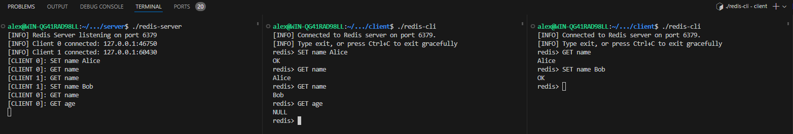

# redis-clone

A minimal Redis-like server and client implementation in C/C++.

This project simulates basic Redis functionality using custom socket programming and a simple key-value store. It implements a length-prefixed protocol over TCP, supports concurrent clients using an event-driven polling model, and processes simple commands like `SET` and `GET`.



---

### 🛠️ Features

- TCP Server/Client with `socket()`, `bind()`, `listen()`, and `connect()`
- Non-blocking I/O with `poll()` for scalable connection handling
- Length-prefixed protocol for structured communication
- Basic Redis-like commands: `SET <key> <value>`, `GET <key>`
- In-memory key-value store using `std::unordered_map`
- Minimal command parsing with error handling
- Graceful shutdown on `Ctrl+C` (via signal handling)
- Clean CLI interface with custom prompt

---

### ⚙️ Architecture

```text
Client (RedisClient)
    -> Connects to server
    -> Sends user commands as length-prefixed messages
    -> Receives and prints server response

Server (RedisServer)
    -> Accepts multiple client connections
    -> Uses poll() to handle many clients in one thread
    -> Parses incoming commands and dispatches handlers
    -> Replies with appropriate result (e.g., OK, value, error)
```

---

### 🚀 How to run

**Prerequisites**

- GCC/Clang
- CMake
- Linux environment (or WSL)

**Steps**

1. `cmake -B build`
2. `cd build`
3. `make`
4. Running
    - Server: `./redis-server`
    - Client: `./redis-cli`

Note that `redis-server` must be ran in another terminal prior to running `redis-cli`.
